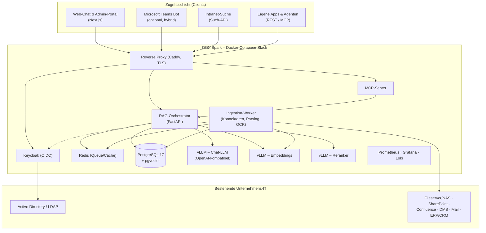
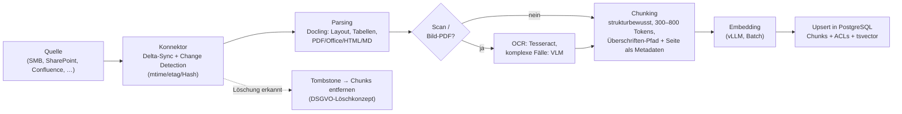
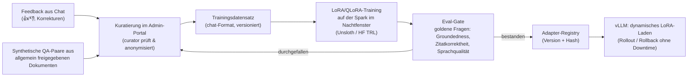
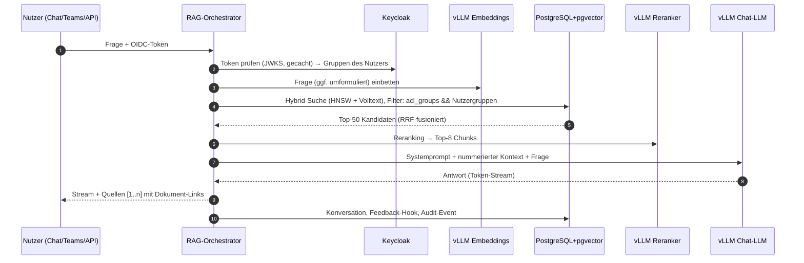

# OnLumis-Plattform – Architekturmodell

**Produkt:** OnLumis – lokale Unternehmens-KI der JULITH GmbH
**Zielplattform:** NVIDIA DGX Spark (On-Premise), Betrieb vollständig via Docker
**Status:** Entwurf v1.0 · Grundlage für den [Implementierungsplan](implementierungsplan.md)

---

## Inhalt

1. [Zweck & Geltungsbereich](#1-zweck--geltungsbereich)
2. [Anforderungen aus dem Produktversprechen](#2-anforderungen-aus-dem-produktversprechen)
3. [Architekturprinzipien](#3-architekturprinzipien)
4. [Systemüberblick](#4-systemüberblick)
5. [Zielplattform DGX Spark](#5-zielplattform-dgx-spark)
6. [Bausteine im Detail](#6-bausteine-im-detail)
7. [Zentrale Abläufe](#7-zentrale-abläufe)
8. [Datenmodell (PostgreSQL + pgvector)](#8-datenmodell-postgresql--pgvector)
9. [Schnittstellen (API-Übersicht)](#9-schnittstellen-api-übersicht)
10. [Deployment-Sicht](#10-deployment-sicht)
11. [Sizing, Qualitätsziele & Skalierungspfad](#11-sizing-qualitätsziele--skalierungspfad)
12. [Technologie-Entscheidungen (Kurz-ADRs)](#12-technologie-entscheidungen-kurz-adrs)
13. [Risiken & offene Punkte](#13-risiken--offene-punkte)

---

## 1. Zweck & Geltungsbereich

OnLumis ist eine interne Unternehmensplattform, die lokal beim Kunden (z. B. auf einer
NVIDIA DGX Spark) betrieben wird und internes Unternehmenswissen über Chat, intelligente
Suche und APIs verfügbar macht. Kernbausteine:

- **Lokale Sprachmodelle (LLM/VLM)**, gehostet mit **vLLM** auf der DGX Spark
- **Retrieval-Augmented Generation (RAG)** mit Quellenangaben bis auf Dokument/Seite
- **Vektordaten in einer dockerisierten PostgreSQL** (Extension `pgvector`)
- **Fine-Tuning** (LoRA-Adapter) für Tonalität, Terminologie und Antwortformate
- **Zugriff** über Web-Chat, Intranet-Suche, Microsoft Teams, REST-API und MCP

Dieses Dokument beschreibt die Zielarchitektur der Plattform (nicht der Marketing-Website
in diesem Repository). Die Umsetzung erfolgt in einem eigenen Repository
`onlumis-platform` (siehe Implementierungsplan, Abschnitt Repo-Struktur).

## 2. Anforderungen aus dem Produktversprechen

Abgeleitet aus den Produktseiten dieses Repos (`/produkt`, `/anwendungsfaelle`,
`/vorteile`, FAQ). Jede Zusage der Website ist einem Architekturbaustein zugeordnet:

| # | Zusage der Website | Architekturbaustein |
|---|--------------------|---------------------|
| A1 | Antworten ausschließlich aus freigegebenem Firmenwissen, mit **Quellenangabe** | RAG-Orchestrator mit Zitations-Pipeline (§6.2, §7.1) |
| A2 | Datenquellen: Fileserver/NAS, DMS (ELO, d.velop, DATEV-Umfeld), SharePoint/OneDrive/Google Workspace, Confluence/Wikis, E-Mail/Ticketsysteme, ERP/CRM-Exporte, Office-Formate, **Scans per OCR** | Ingestion-Pipeline + Konnektor-Framework (§6.5) |
| A3 | Lokales, quelloffenes Sprachmodell, **kein Cloud-Zwang**, Modelle austauschbar | vLLM-Serving-Schicht + Modellregistry (§6.3) |
| A4 | Zugriff über **Chat, intelligente Suche, Teams, dokumentierte API** | Zugriffsschicht (§6.1), API (§9) |
| A5 | **AD/LDAP/SSO**, Rechte **bis auf Dokumentenebene** | Keycloak + ACL-Modell im Retrieval (§6.6) |
| A6 | **Verschlüsselung** at rest & in transit, auch im internen Netz | Sicherheitskonzept (§6.6) |
| A7 | **Protokollierung**: wer hat worauf zugegriffen | Audit-Log (§6.6, §8) |
| A8 | **Air-gapped**-Betrieb möglich | Offline-Betriebsmodus (§6.8) |
| A9 | System wird „mit jedem Dokument klüger" | Inkrementelle Delta-Syncs (§6.5) |
| A10 | Betrieb On-Premise, Private Cloud DE/EU oder hybrid | Portables Docker-Compose-Deployment (§10) |
| A11 | JULITH übernimmt Updates, **Modellpflege**, Support | Model-Ops & Update-Strategie (§6.7, §6.8) |

**Nicht-funktionale Ziele (v1):**

| Ziel | Wert (Richtgröße, im Pilot zu validieren) |
|---|---|
| Sprachqualität | Deutsch als Primärsprache (Fragen, Antworten, Suche), Englisch sekundär |
| Latenz Chat | Zeit bis erstes Token p50 < 2 s, p95 < 6 s (inkl. Retrieval + Reranking) |
| Parallelität | 10–20 gleichzeitige aktive Chats (KMU mit 50–500 Mitarbeitenden) |
| Korpusgröße | bis ~1 Mio. Chunks (~100–200 k Dokumente) auf einer Spark |
| Verfügbarkeit | Werktags-Betrieb, Single-Node; HA optional über zweite Spark (§11) |
| Datenschutz | DSGVO/DSG-konform: AVV, Löschkonzept, Betroffenenrechte, pseudonymisierbare Logs |

## 3. Architekturprinzipien

1. **Local-first:** Jede Komponente läuft ohne Internetzugang. Externe Dienste (z. B.
   Teams) sind optionale Add-ons, nie Voraussetzung.
2. **Wissen nur über RAG, nie über Modellgewichte:** Dokumenten-Berechtigungen werden
   zur Laufzeit im Retrieval durchgesetzt. Fine-Tuning trainiert deshalb ausschließlich
   *Verhalten* (Stil, Format, Terminologie) – niemals vertrauliche Inhalte, denn in
   Gewichte eingebranntes Wissen würde die Dokument-ACLs umgehen.
3. **OpenAI-kompatible Schnittstellen:** vLLM und die Plattform-API sprechen das
   OpenAI-API-Schema. Dadurch sind Modelle austauschbar (A3) und Standard-Tooling
   (SDKs, Clients, Agenten) funktioniert ohne Anpassung.
4. **Ein Compose-Stack, drei Betriebsmodelle:** identisches Artefakt für On-Premise,
   Private Cloud und hybrid; Air-Gap ist eine Konfigurations-, keine Architekturfrage.
5. **PostgreSQL als ein Wissensspeicher:** Chunks, Embeddings, Volltextindex, ACLs,
   Konversationen und Audit-Log liegen in einer Datenbank → ein Backup, eine
   Zugriffskontrolle, transaktionale Konsistenz zwischen Dokument und Vektor.
6. **Alles containerisiert (ARM64):** Die DGX Spark ist eine aarch64-Plattform; sämtliche
   Images müssen multi-arch bzw. arm64 verfügbar sein (Auswahlkriterium für jede
   Komponente).
7. **Beobachtbar & auditierbar:** Jede Antwort ist auf Chunks, Dokumente und
   Modellversion rückführbar (A1, A7).

## 4. Systemüberblick



Lesart: Alle Clients gehen durch einen TLS-terminierenden Reverse Proxy. Der
RAG-Orchestrator ist die einzige Komponente, die Modelle und Datenbank anspricht –
vLLM-Endpunkte sind nie direkt aus dem Client-Netz erreichbar.

## 5. Zielplattform DGX Spark

| Eigenschaft | Wert | Konsequenz für die Architektur |
|---|---|---|
| SoC | NVIDIA GB10 Grace Blackwell | NVIDIA-AI-Stack (CUDA 13, NGC-Container) nutzbar |
| CPU | 20 ARM-Kerne (aarch64) | **alle Images arm64**; keine x86-only-Abhängigkeiten |
| Speicher | 128 GB **unified** LPDDR5x (~273 GB/s) | CPU & GPU teilen sich RAM → hartes gemeinsames Speicherbudget (§11); Bandbreite begrenzt Token-Durchsatz großer Modelle |
| Storage | 1–4 TB NVMe | Korpus, Modelle, Postgres komfortabel lokal; LUKS-Verschlüsselung at rest |
| Netzwerk | 10 GbE + ConnectX-7 (200 Gb) | zweite Spark koppelbar (größeres Modell / HA / Finetuning-Offload) |
| OS | DGX OS (Ubuntu-basiert) | Docker + NVIDIA Container Toolkit vorinstalliert |
| Leistungsaufnahme | ~170 W | „Serverraum-los" beim Kunden betreibbar (KMU-tauglich, leise) |

vLLM wird über den von NVIDIA für die Spark bereitgestellten Container
(NGC, aarch64/CUDA) betrieben; NVIDIA pflegt dafür offizielle DGX-Spark-Playbooks
(Inference und LoRA-Fine-Tuning). Kein eigenes CUDA-Build nötig.

## 6. Bausteine im Detail

### 6.1 Zugriffsschicht

| Kanal | Umsetzung | Hinweise |
|---|---|---|
| **Web-Chat** | Eigene Next.js-App (gleicher Stack wie Website, Corporate-Design-fähig, A4) | Streaming (SSE), Quellen-Panel mit Deep-Links auf Ursprungsdokument, Feedback (👍/👎 + Korrektur), Konversationshistorie |
| **Admin-Portal** | Teil der Next.js-App, Rolle `admin` | Quellen & Sync-Status, ACL-Zuordnung, Nutzungsstatistik, Feedback-Kuratierung, Eval-Dashboard, API-Key-Verwaltung |
| **Intranet-Suche** | `POST /v1/search` (Retrieval ohne Generierung) | einbettbar in bestehende Portale; liefert Treffer + Snippet + Quelle |
| **Microsoft Teams** | Bot-Framework-Bot → ruft intern die Plattform-API | benötigt Azure-Bot-Registrierung und ausgehende Erreichbarkeit → **nur im Hybrid-Modus**, entfällt bei Air-Gap (dann Verweis auf Web-Chat) |
| **REST-API** | OpenAI-kompatibel + OnLumis-Erweiterungen (§9) | für Fachanwendungen, Skripte, Automatisierung; Auth via OIDC-Token oder API-Key |
| **MCP-Server** | Model Context Protocol (Streamable HTTP) mit Tools `search_knowledge`, `answer_with_sources` | macht das Firmenwissen für interne Agenten/Assistenz-Tools nutzbar („andere Tools", A4); Auth via OIDC |

### 6.2 Anwendungsschicht: RAG-Orchestrator (FastAPI)

Zentrale Komponente; Python/FastAPI wegen des KI-Ökosystems. Verantwortlichkeiten:

- **AuthN/AuthZ:** OIDC-Token-Validierung (Keycloak), Auflösung der Gruppenzugehörigkeit
  des Nutzers für die ACL-Filterung; API-Key-Auth für Service-Clients.
- **Retrieval-Pipeline:** optionales Query-Rewriting (Kontext aus Konversation),
  Embedding der Frage, **Hybrid-Suche** (Vektor + Volltext, Fusion via Reciprocal Rank
  Fusion), **Reranking**, Kontextassemblierung mit nummerierten Quellen.
- **Generierung:** Prompt-Templates (Systemregeln: „antworte nur aus dem Kontext; wenn
  die Information fehlt, sage das"), Streaming vom vLLM zum Client, Zitations-Mapping
  `[1]…[n]` → Dokument-URI/Seite.
- **Konversations- & Feedback-Verwaltung, Audit-Logging, Rate-Limiting.**
- **Guardrails:** Retrieval-Kontext wird strikt als Daten (nicht als Instruktion)
  gepromptet – Schutz gegen indirekte Prompt-Injection aus indizierten Dokumenten;
  in v1 keine Tool-Ausführung auf Basis abgerufener Inhalte.

### 6.3 Modell-Serving (vLLM auf der Spark)

Drei dauerhafte vLLM-Prozesse mit fester Speicherzuteilung (`--gpu-memory-utilization`
pro Instanz, da unified memory), alle OpenAI-kompatibel:

| Rolle | Standardmodell (v1) | Alternativen | Speicher (Richtwert) |
|---|---|---|---|
| **Chat-LLM** | nvidia/Qwen3.6-35B-A3B-**NVFP4** (MoE, 3B aktiv – schnell auf der bandbreitenlimitierten Spark; Blackwell-natives NVFP4 von NVIDIA) | nvidia/NVIDIA-Nemotron-3-Super-120B-A12B-NVFP4 (höchste Qualität), nvidia/Qwen3-32B-NVFP4 (dicht/konservativ), nvidia/Llama-3.1-8B-Instruct-NVFP4 (kompakt) | ~30–90 GB inkl. KV-Cache je Preset |
| **Embeddings** | BGE-M3 (multilingual, 1024 Dim., 8k Kontext) | Qwen3-Embedding-0.6B/4B | ~3–5 GB |
| **Reranker** | BGE-reranker-v2-m3 | Qwen3-Reranker-0.6B | ~3–5 GB |
| **VLM/OCR** (on-demand) | Qwen2.5-VL-7B für komplexe Scans/Tabellen | – | ~10 GB, nur bei Ingestion-Läufen gestartet |

- **Modellregistry:** `models/`-Manifeste (Name, HF-Quelle, Hash, Lizenz, vLLM-Startargumente,
  Quantisierung). Download-Skripte erzeugen Offline-Bundles für Air-Gap-Installationen
  (`HF_HUB_OFFLINE=1`).
- **LoRA-Adapter:** vLLM `--enable-lora` mit dynamischem Adapter-Laden → kundenspezifische
  Adapter ohne Neustart aktivierbar/rollbackfähig (§6.7).
- **Modellwechsel** (A3/A11): neues Manifest → Eval-Gate (goldene Fragen, §6.7) →
  kontrolliertes Rollout im Wartungsfenster.

### 6.4 Wissensspeicher: PostgreSQL + pgvector (dockerisiert)

Image `pgvector/pgvector:pg17` (multi-arch, arm64). Eine Instanz, mehrere Schemata
(`knowledge`, `app`, `audit`).

- **Hybrid-Retrieval in einer Query:** HNSW-Vektorindex (Cosine) für semantische Treffer
  + `tsvector`-Volltextindex (`german`-Konfiguration, Stemming) für exakte
  Begriffe/Artikelnummern; Fusion per RRF im Orchestrator, danach Reranker.
- **ACL-Durchsetzung auf SQL-Ebene:** jeder Chunk erbt `acl_groups` seines Dokuments;
  jede Suche filtert `WHERE d.acl_groups && :user_groups` – Berechtigungen wirken damit
  *vor* dem Modell (A5), nicht als nachgelagerter Filter.
- **Sizing:** 1 Mio. Chunks × (1024 Dim. × 4 Byte + Text + Indizes) ≈ 15–25 GB –
  unkritisch für NVMe; HNSW-Aufbau beim Erstimport mit erhöhtem
  `maintenance_work_mem`, Index nach Bulk-Load erstellen. Option `halfvec` halbiert
  Vektorspeicher bei minimalem Qualitätsverlust.
- **Skalierungsgrenze:** bis ~5–10 Mio. Chunks solide; darüber Partitionierung nach
  Quelle oder Wechsel auf dedizierte Vektor-DB (bewusst als späterer Migrationspfad
  hinter einem Retrieval-Interface gekapselt, §12).

### 6.5 Ingestion-Pipeline & Konnektoren



- **Worker-Modell:** eigenständiger Container (`ingestion-worker`), Jobs über Redis-Queue,
  Zeitplan pro Quelle (z. B. nächtlicher Voll-Sync + stündliche Deltas → A9).
- **ACL-Übernahme:** Konnektoren lesen Quell-Berechtigungen (NTFS-Gruppen, SharePoint-
  Permissions, Confluence-Space-Rechte) und mappen sie auf AD-Gruppen; wo die Quelle
  keine Rechte liefert, wird die ACL bei der Quellen-Registrierung im Admin-Portal
  festgelegt (Default: restriktiv).
- **Konnektor-Ausbaustufen** (Reihenfolge = Implementierungsplan):
  1. **v1:** Dateisystem (SMB/NFS-Mounts) – PDF, DOCX, XLSX, PPTX, MD, TXT, HTML, Scans (OCR)
  2. **v2:** SharePoint/OneDrive (MS Graph), Confluence (REST), IMAP-Postfächer, Ticketsysteme (Jira/Zammad)
  3. **v3:** DMS (ELO, d.velop) über deren APIs, ERP/CRM-/DATEV-Exporte (CSV/DB-Views), Google Workspace
- **Hygiene:** Deduplizierung über Content-Hash; Erkennung eingebetteter Instruktionen
  („ignore previous …") wird geloggt und markiert (Prompt-Injection-Flag).

### 6.6 Identität, Berechtigungen & Sicherheit

| Thema | Umsetzung |
|---|---|
| **Identität** | Keycloak (Container) als OIDC-Provider; **Federation zu AD/LDAP** des Kunden (A5), optional SAML/Entra ID. Gruppen aus AD werden 1:1 als ACL-Subjekte genutzt. |
| **Rollen** | `user` (Chat/Suche), `curator` (Quellen & Feedback), `admin` (Vollzugriff), `auditor` (nur Audit-Log). |
| **Dokument-ACLs** | `documents.acl_groups text[]` – Durchsetzung per SQL bei jedem Retrieval (§6.4). Antworten können nur Wissen enthalten, das der Fragende sehen darf. |
| **Transportverschlüsselung** | TLS überall, auch intern (A6): Caddy terminiert extern; interne Dienste über eigenes Compose-Netz + interne CA (Caddy/step-ca) bzw. mTLS für Postgres. |
| **At rest** | LUKS-verschlüsselte NVMe (DGX-OS-Setup); Konnektor-Zugangsdaten verschlüsselt (sops/age), nie im Klartext in der DB. |
| **Audit** | Append-only `audit.events`: wer, wann, welche Frage (konfigurierbar: Klartext/pseudonymisiert – Betriebsrats-Thema), welche Dokumente im Kontext, welches Modell/Adapter (A7). Export als CSV/JSON für DSB. |
| **Netztrennung** | Compose-Netze `edge` / `app` / `data` / `ml`; nur der Proxy exponiert Ports; vLLM & Postgres sind von außen unerreichbar. |
| **DSGVO/DSG** | AVV (Art. 28), TOMs dokumentiert, Löschkonzept (§6.5), Auskunftsfähigkeit über Audit-Export, Aufbewahrungsfristen für Chats & Logs konfigurierbar. |

### 6.7 Fine-Tuning & Model-Ops

**Zweck (bewusst begrenzt, siehe Prinzip 2):** deutsche Tonalität und Firmenterminologie,
Zitiertreue, abteilungsspezifische Antwortformate (z. B. Angebots-Textbausteine im
Vertrieb) – *kein* Einbrennen von Fakten (veraltet, und es würde Dokumentrechte umgehen).



- **Trainingsfenster:** Nachts auf derselben Spark (Serving gedrosselt) oder auf einer
  zweiten Spark/Workstation; LoRA bis ~32B komfortabel, QLoRA bis ~70B machbar.
- **Eval-Harness:** pro Kunde 50–200 goldene Fragen mit Referenzantworten und
  erwarteten Quellen; Metriken: Retrieval-Trefferquote, Groundedness/Zitatkorrektheit
  (LLM-as-Judge, lokal), Stil. Läuft nightly und als Gate vor jedem Modell-/Adapter-/
  Prompt-Rollout (A11).
- **Kadenz:** Adapter-Updates quartalsweise oder anlassbezogen; Basismodell-Wechsel
  nur nach Eval-Gate im Wartungsfenster.

### 6.8 Betrieb, Observability & Updates

- **Monitoring:** Prometheus + Grafana; vLLM-`/metrics` (TTFT, Durchsatz, KV-Cache-
  Auslastung), GPU/DCGM, Postgres-Exporter, API-Latenzen, Ingestion-Lag pro Quelle.
  Logs zentral via Loki. Alerting (z. B. Sync-Fehler, Diskfüllstand) per Mail/Webhook.
- **Backups:** nächtlich `pg_dump` (bzw. pgBackRest) + Konfig/Compose aus Git +
  Modell-Manifeste; Ziel: Kunden-NAS. RPO 24 h, Wiederherstellung dokumentiert
  (Runbook). Modelle sind über Manifeste reproduzierbar, Adapter werden mitgesichert.
- **Updates (A11):** monatliches Wartungsfenster; signierte Compose-/Image-Bundles.
  **Air-Gap:** lokaler Registry-Mirror (`registry:2`), Bundles per Datenträger; Verbund-
  Modus: Pull über JULITH-Registry. Nach jedem Update automatischer Smoke-Test +
  goldene Fragen.
- **Betriebsmodelle (A10):** identischer Stack auf Kunden-Spark (On-Premise), auf
  dedizierter GPU-VM im DE/EU-Rechenzentrum (Private Cloud) oder hybrid.

## 7. Zentrale Abläufe

### 7.1 Chat-Anfrage mit RAG (Kernfluss)



### 7.2 Dokument-Lebenszyklus

Neu/geändert → Delta-Sync erkennt Hash-Änderung → Parsing/OCR → Chunking → Embedding →
transaktionaler Upsert (alte Chunks des Dokuments ersetzt). Gelöscht in der Quelle →
Tombstone → Chunks + Dokument entfernt, Audit-Eintrag bleibt (Löschkonzept). Damit ist
die Wissensbasis maximal `Sync-Intervall` hinter der Quelle (A9).

## 8. Datenmodell (PostgreSQL + pgvector)

Kern-DDL (Schema `knowledge`; App-/Audit-Tabellen analog):

```sql
CREATE EXTENSION IF NOT EXISTS vector;

CREATE TABLE sources (
  id           uuid PRIMARY KEY DEFAULT gen_random_uuid(),
  kind         text NOT NULL,          -- 'smb' | 'sharepoint' | 'confluence' | 'imap' | ...
  name         text NOT NULL,
  config       jsonb NOT NULL,         -- Zugangsdaten verschlüsselt (sops/age)
  default_acl  text[] NOT NULL DEFAULT '{}',
  enabled      boolean NOT NULL DEFAULT true,
  last_sync_at timestamptz
);

CREATE TABLE documents (
  id           uuid PRIMARY KEY DEFAULT gen_random_uuid(),
  source_id    uuid NOT NULL REFERENCES sources(id),
  external_id  text NOT NULL,          -- Pfad / Item-ID in der Quelle
  uri          text NOT NULL,          -- klickbare Quellenangabe (A1)
  title        text,
  mime_type    text,
  content_hash text NOT NULL,          -- Change Detection & Dedup
  acl_groups   text[] NOT NULL,        -- AD-Gruppen (A5)
  meta         jsonb NOT NULL DEFAULT '{}',
  updated_at   timestamptz NOT NULL DEFAULT now(),
  deleted_at   timestamptz,
  UNIQUE (source_id, external_id)
);
CREATE INDEX ON documents USING gin (acl_groups);

CREATE TABLE chunks (
  id           bigserial PRIMARY KEY,
  document_id  uuid NOT NULL REFERENCES documents(id) ON DELETE CASCADE,
  chunk_index  int  NOT NULL,
  content      text NOT NULL,
  heading_path text,                   -- "Handbuch › Kap. 3 › Wartung" (Zitate)
  page         int,
  embedding    vector(1024) NOT NULL,  -- BGE-M3
  tsv          tsvector GENERATED ALWAYS AS (to_tsvector('german', content)) STORED
);
CREATE INDEX ON chunks USING hnsw (embedding vector_cosine_ops);
CREATE INDEX ON chunks USING gin (tsv);
```

Weitere Tabellen (App-Schema): `conversations`, `messages` (inkl. verwendeter
Chunk-IDs + Modell/Adapter-Version je Antwort), `feedback`, `api_keys` (gehasht,
scoped), `eval_questions`, `eval_runs`; Audit-Schema: `audit.events` (append-only).

Hybrid-Suche (Skizze): Vektor-Top-k und Volltext-Top-k jeweils mit
`WHERE d.acl_groups && :user_groups AND d.deleted_at IS NULL`, Fusion per RRF
(`score = Σ 1/(60 + rank)`), danach Reranker über die Top-50.

## 9. Schnittstellen (API-Übersicht)

| Endpoint | Zweck | Auth |
|---|---|---|
| `POST /v1/chat/completions` | OpenAI-kompatibel; `metadata.rag: true` aktiviert Retrieval, Antwort enthält `citations[]` | OIDC / API-Key |
| `POST /v1/answers` | Frage → Antwort + Quellen (vereinfachte RAG-Antwort für Integrationen) | OIDC / API-Key |
| `POST /v1/search` | Retrieval ohne Generierung (Intranet-Suche): Treffer, Snippets, Quellen | OIDC / API-Key |
| `GET /v1/documents/{id}` | Metadaten + Quell-Link (für Zitat-Auflösung) | OIDC |
| `POST /v1/feedback` | Bewertung/Korrektur zu einer Antwort | OIDC |
| `Admin: /v1/admin/*` (sources, syncs, acl, stats, evals) | Quellenverwaltung, Sync-Status, ACLs, Statistik, Eval-Läufe | Rolle `admin`/`curator` |
| `MCP /mcp` | Tools `search_knowledge`, `answer_with_sources` | OIDC |

Alle Endpunkte werden mit OpenAPI dokumentiert (A4: „dokumentierte API").

## 10. Deployment-Sicht

Ein `docker-compose.yml` (+ Overrides `compose.airgap.yml`, `compose.dev.yml`):

| Dienst | Image (arm64) | Netz | Port (intern) |
|---|---|---|---|
| `proxy` | caddy | edge | 443 (einziger exponierter Port) |
| `webapp` | eigenes Next.js-Image | edge/app | 3000 |
| `api` | eigenes FastAPI-Image | app/data/ml | 8000 |
| `mcp` | eigenes Image (oder Teil von `api`) | app | 8010 |
| `keycloak` | quay.io/keycloak/keycloak | app/data | 8080 |
| `postgres` | pgvector/pgvector:pg17 | data | 5432 |
| `redis` | redis:7 | app | 6379 |
| `ingestion` | eigenes Worker-Image | app/data/ml | – |
| `vllm-chat` | NGC vLLM (DGX Spark) | ml | 8001 |
| `vllm-embed` | NGC vLLM | ml | 8002 |
| `vllm-rerank` | NGC vLLM | ml | 8003 |
| `prometheus`/`grafana`/`loki` | offizielle Images | app | 9090/3001/3100 |

**Speicherbudget (128 GB unified, Richtwerte):**

| Block | Budget |
|---|---|
| vLLM Chat-LLM (32B FP8 inkl. KV-Cache) | ~60 GB |
| vLLM Embeddings + Reranker | ~8 GB |
| VLM/OCR (nur während Ingestion) | ~10 GB |
| Postgres, Redis, Keycloak, API, Webapp, Monitoring | ~12 GB |
| OS + Reserve (Spitzen, Finetuning-Nachtfenster) | ~38 GB |

## 11. Sizing, Qualitätsziele & Skalierungspfad

- **Durchsatz:** vLLM Continuous Batching; 10–20 parallele Chats mit einem 32B-FP8-Modell
  realistisch (Spark-Speicherbandbreite ist der begrenzende Faktor – Werte im PoC messen,
  AP 1.9). Für höhere Qualität (gpt-oss-120b/70B) sinkt der Durchsatz → Modellwahl ist
  eine dokumentierte Kundenentscheidung (Qualität vs. Tempo).
- **Erst-Import:** Embedding-Durchsatz (Batch) dimensioniert Erstindexierung: ~100 k
  Dokumente über ein Wochenende, danach Deltas im Minuten-/Stundenbereich.
- **Skalierungspfad:**
  1. Zweite Spark via ConnectX-7: größeres Modell (Tensor-Parallel), Trennung
     Serving/Fine-Tuning oder Aktiv/Passiv-HA.
  2. Private-Cloud-Variante auf größerer GPU (identischer Compose-Stack).
  3. > 5–10 Mio. Chunks: Partitionierung bzw. dedizierte Vektor-DB hinter dem
     Retrieval-Interface (§12).

## 12. Technologie-Entscheidungen (Kurz-ADRs)

| # | Entscheidung | Begründung | Verworfene Alternativen |
|---|---|---|---|
| ADR-1 | **vLLM** als Serving-Layer | OpenAI-API, Continuous Batching, LoRA-Hot-Swap, NVIDIA-Support auf Spark (Vorgabe) | Ollama (geringerer Durchsatz, weniger Multi-User-tauglich), TGI, NIM-only |
| ADR-2 | **PostgreSQL + pgvector** für Vektoren | eine DB für Chunks/ACLs/App/Audit, transaktional, arm64-Image, Betriebs-Know-how (Vorgabe „dockerized PostgreSQL") | Qdrant/Weaviate (zweites System, ACL-Join teurer); als Skalierungsoption vorgemerkt |
| ADR-3 | **Hybrid-Suche + Reranker** statt nur Vektor | deutsche Fachbegriffe/Artikelnummern brauchen exakte Treffer; Reranker hebt Präzision deutlich | reine Vektorsuche (Recall-Lücken), Elasticsearch (zweites System) |
| ADR-4 | **Keycloak** für Identität | AD/LDAP-Federation, OIDC/SAML, arm64, self-hosted (A5) | Authentik, Eigenbau (Risiko) |
| ADR-5 | **Eigene Next.js-Chat-UI** | Corporate Design (A4), volle Kontrolle über Quellen-UX/Feedback, Stack-Konsistenz zur Website | Open WebUI (schneller Start, aber Branding/ACL/Audit-Integration begrenzt) – ggf. als internes Übergangs-Frontend in Phase 1 |
| ADR-6 | **Docling** (+ Tesseract, VLM-Fallback) fürs Parsing | Layout-/Tabellenerkennung, breite Formatabdeckung, lokal | unstructured.io, Tika (schwächere Tabellen/Layout) |
| ADR-7 | **Docker Compose** statt Kubernetes | Single-Node-Appliance, geringe Betriebs-Komplexität beim KMU | k3s (erst relevant bei Multi-Node/HA-Anforderung) |
| ADR-8 | **Redis** als Queue/Cache | einfache, robuste Job-Queue für Ingestion; Session-/JWKS-Cache | Postgres-Queue (Option, ein System weniger – bei Bedarf wechselbar) |
| ADR-9 | Wissen **nur via RAG**, Fine-Tuning nur für Verhalten | Dokument-ACLs müssen zur Laufzeit greifen; Gewichte kennen keine Rechte | „Wissens-Finetuning" (Rechte-Leck, Veraltung) |

## 13. Risiken & offene Punkte

| Risiko | Auswirkung | Gegenmaßnahme |
|---|---|---|
| Speicherbandbreite der Spark begrenzt Token-Durchsatz großer Modelle | Latenz bei vielen parallelen Nutzern | Modell-Matrix je Kundengröße (24B/32B Standard), Messung im PoC (AP 1.9), Zwei-Spark-Option |
| ACL-Mapping aus Quellen unvollständig (z. B. verschachtelte NTFS-Rechte) | zu breite oder zu enge Sichtbarkeit | Default restriktiv, Admin-Review vor Freischaltung einer Quelle, ACL-Testfälle im Eval |
| OCR-Qualität bei schlechten Scans | falsche Antworten | Konfidenz-Schwelle, VLM-Fallback, Kennzeichnung „OCR-Quelle" im Zitat |
| Teams-Anbindung erfordert Azure-Registrierung | im Air-Gap nicht möglich | klar als Hybrid-Feature deklariert (Vertrieb + Doku) |
| arm64-Verfügbarkeit einzelner Images | Integrationsaufwand | Auswahlkriterium in §3; CI baut eigene Images multi-arch |
| Indirekte Prompt-Injection über indizierte Dokumente | manipulierte Antworten | Kontext-als-Daten-Prompting, Injection-Flags in Ingestion, keine Tool-Ausführung aus Kontext (v1) |
| Betriebsrat/Datenschutz bei Chat-Protokollierung | Einführungs-Blocker | pseudonymisierte Logs als Default, Retention konfigurierbar, DSB-Doku im Onboarding |

**Offen (mit Empfehlung):** endgültige Modellwahl je Pilotkunde (Empfehlung: Qwen3-32B
FP8 als Start), Feinschnitt Query-Rewriting (erst ab Phase 3 aktivieren), Postgres-Queue
statt Redis (v2 prüfen).
