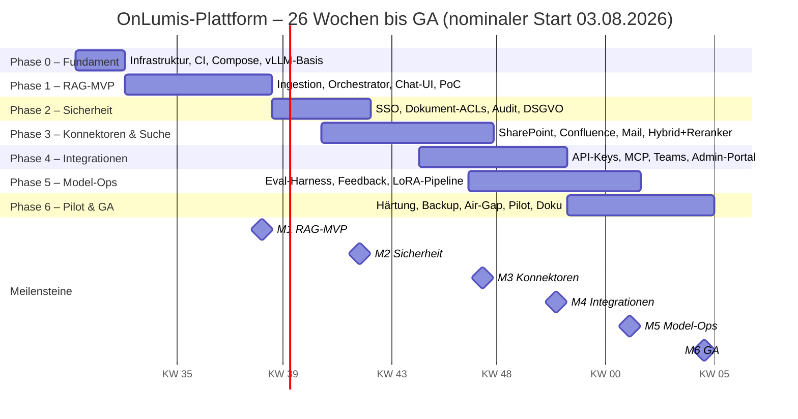

# OnLumis-Plattform – Implementierungsplan

**Grundlage:** [Architekturmodell](architektur.md) · **Status:** v1.0, Umsetzung begonnen
**Planungshorizont:** ~26 Wochen bis General Availability (GA), MVP nach 8 Wochen
**Nominaler Start:** 03.08.2026 (alle Daten relativ verschiebbar)

> **Umsetzungsstand:** Die Software-Arbeitspakete der Phasen 0–5 sind unter
> [`platform/`](../platform/) implementiert und getestet (RAG-Kern, Sicherheit
> inkl. OIDC/API-Keys/Audit, Konnektoren, MCP/Admin-Portal, Eval-Harness,
> LoRA-Pipeline). Offen sind bewusst deployment-gebundene Punkte (Teams-Bot,
> AD-Federation beim Kunden, Lasttest/Pilot/Air-Gap aus Phase 6) – Details in
> der Status-Tabelle des [`platform/README.md`](../platform/README.md).

---

## Inhalt

1. [Zielbild & Meilensteine](#1-zielbild--meilensteine)
2. [Phasenplan](#2-phasenplan)
3. [Zeitplan (Gantt)](#3-zeitplan-gantt)
4. [Team, Rollen & Aufwand](#4-team-rollen--aufwand)
5. [Repository- & Servicestruktur](#5-repository--servicestruktur)
6. [Test- & Qualitätsstrategie](#6-test--qualitätsstrategie)
7. [Pilot & Go-Live-Kriterien](#7-pilot--go-live-kriterien)
8. [Betrieb nach GA](#8-betrieb-nach-ga)
9. [Risiken & Gegenmaßnahmen](#9-risiken--gegenmaßnahmen)
10. [Offene Entscheidungen](#10-offene-entscheidungen)

---

## 1. Zielbild & Meilensteine

| Meilenstein | Ende Woche | Ergebnis (Definition of Done) |
|---|---|---|
| **M0 – Fundament** | 2 | Spark provisioniert, Compose-Skeleton läuft (Proxy, Postgres+pgvector, Keycloak, Monitoring), CI baut arm64-Images, TLS intern/extern aktiv |
| **M1 – RAG-MVP** | 8 | Datei-Ingestion (SMB/NFS inkl. OCR), Chat-UI mit Streaming & Quellenangaben, vLLM-Serving (Chat+Embeddings), Pilotkorpus indexiert, PoC-Messwerte dokumentiert |
| **M2 – Unternehmenstauglich** | 12 | AD/LDAP-SSO über Keycloak, Dokument-ACLs im Retrieval durchgesetzt (0 Verstöße in Tests), Audit-Log + Export, Verschlüsselung at rest |
| **M3 – Konnektoren & Suche** | 17 | SharePoint-, Confluence-, IMAP-Konnektor mit Delta-Sync & Löschkonzept, Hybrid-Suche + Reranker, Such-API für Intranet |
| **M4 – Integrationen** | 20 | Teams-Bot (Hybrid-Modus), öffentliche REST-API mit API-Keys + OpenAPI-Doku, MCP-Server, Admin-Portal vollständig |
| **M5 – Model-Ops** | 23 | Feedback-Kuratierung, Eval-Harness (goldene Fragen, nightly), LoRA-Trainingspipeline, erster Adapter per Eval-Gate produktiv |
| **M6 – GA** | 26 | Pilot abgeschlossen (KPIs erfüllt, §7), Härtung/Lasttest, Backups+Runbooks, Air-Gap-Bundle, Doku komplett → auslieferbares Produkt |

Prinzip: **ab M1 existiert immer ein nutzbares System**; jede Phase erweitert es, statt
Großintegration am Ende.

## 2. Phasenplan

### Phase 0 – Fundament & Infrastruktur (Woche 1–2)

**Ziel:** lauffähige Basisplattform auf der Spark, reproduzierbar aus Git.

| AP | Arbeitspaket | Inhalt |
|---|---|---|
| 0.1 | Spark-Provisionierung | DGX OS einrichten, LUKS-Verschlüsselung NVMe, Docker + NVIDIA Container Toolkit, NGC-Zugang, Firewall-Grundschutz |
| 0.2 | Repo & CI | Monorepo `onlumis-platform` (§5), CI-Pipeline (Lint, Tests, arm64-Image-Builds, Compose-Smoke-Test) |
| 0.3 | Compose-Skeleton | Caddy (TLS, interne CA), Netze `edge/app/data/ml`, Postgres 17+pgvector, Redis, Keycloak (lokale Nutzer), Prometheus/Grafana/Loki |
| 0.4 | Secrets & Konfig | sops/age-Verschlüsselung, `.env`-Schema, Konfig-Konvention pro Betriebsmodell (onprem/cloud/airgap) |
| 0.5 | vLLM-Basisbetrieb | NGC-vLLM-Container auf Spark, Modell-Download-Skripte + Manifeste (`models/`), Chat-Modell (Qwen3-32B FP8) und BGE-M3 als Dienste, `/metrics` in Prometheus |

**Akzeptanz:** `docker compose up` auf frischer Spark ergibt in < 30 min ein System mit
laufendem LLM (OpenAI-Endpoint intern erreichbar), Grafana zeigt vLLM-/DB-Metriken.

### Phase 1 – RAG-MVP (Woche 3–8)

**Ziel:** Ende-zu-Ende-Wissens-Chat mit Quellenangaben über einen Dateisystem-Korpus.

| AP | Arbeitspaket | Inhalt |
|---|---|---|
| 1.1 | Datenmodell | Schema `knowledge`/`app` (DDL aus Architektur §8), Migrationen (Alembic), HNSW-/GIN-Indizes |
| 1.2 | Filesystem-Konnektor | SMB/NFS-Mounts, Scan + Change Detection (Hash/mtime), Tombstones für Löschungen |
| 1.3 | Parsing & OCR | Docling-Integration (PDF, DOCX, XLSX, PPTX, MD, HTML), Tesseract-OCR für Scans, Fehler-/Konfidenz-Handling |
| 1.4 | Chunking & Embedding | strukturbewusstes Chunking (300–800 Tokens, Überschriften-Pfad, Seite), Batch-Embedding via vLLM, transaktionaler Upsert |
| 1.5 | Ingestion-Worker | Redis-Queue, Scheduler (Voll-/Delta-Sync), Sync-Status-Reporting, Dedup |
| 1.6 | RAG-Orchestrator v1 | FastAPI: Vektor-Retrieval mit ACL-Filter (vorerst Quellen-Default-ACL), Prompt-Templates, Streaming, Zitations-Mapping, `POST /v1/answers` + `/v1/chat/completions` |
| 1.7 | Chat-UI v1 | Next.js: Login (Keycloak, lokale Nutzer), Chat mit SSE-Streaming, Quellen-Panel mit Links, Konversationshistorie, Feedback-Buttons (👍/👎 + Kommentar) |
| 1.8 | Pilotkorpus | interner JULITH-Korpus + anonymisierter Beispielkorpus (Handbücher, Richtlinien) indexieren |
| 1.9 | PoC-Messung | Latenz (TTFT p50/p95), Durchsatz bei 5/10/20 parallelen Chats, Embedding-Durchsatz, Speicherprofil → Entscheidungsgrundlage Modell-Matrix |

**Akzeptanz (M1):** 20 Testfragen auf den Pilotkorpus → ≥ 70 % korrekt **und** korrekt
belegt; Antwort verweigert sich sauber bei fehlender Information; TTFT p50 < 2 s bei 5
parallelen Chats.

### Phase 2 – Identität, Berechtigungen & Audit (Woche 9–12)

**Ziel:** unternehmenstaugliche Sicherheit – das zentrale Verkaufsargument.

| AP | Arbeitspaket | Inhalt |
|---|---|---|
| 2.1 | AD/LDAP-Federation | Keycloak-Federation + Gruppen-Sync, Rollenmodell (`user/curator/admin/auditor`), SSO in UI/API |
| 2.2 | Dokument-ACLs | ACL-Übernahme aus NTFS/Quellrechten im Filesystem-Konnektor, Admin-UI zur ACL-Zuordnung pro Quelle, ACL-Filter in jeder Retrieval-Query |
| 2.3 | ACL-Testsuite | automatisierte Negativtests („Nutzer ohne Gruppe X darf niemals Inhalt aus X sehen") als CI-Gate |
| 2.4 | Audit-Log | append-only `audit.events`, Pseudonymisierungs-Option, Export (CSV/JSON), Auditor-Ansicht |
| 2.5 | Härtung Transport/at rest | interne TLS/mTLS (Postgres, vLLM-Netz), Security-Header, Rate-Limiting, Secrets-Review |
| 2.6 | DSGVO-Paket | AVV-Vorlage, TOMs, Löschkonzept-Doku, Retention-Konfiguration für Chats/Logs |

**Akzeptanz (M2):** SSO-Login gegen Test-AD; ACL-Testsuite 100 % grün; DSB-taugliches
Audit-Exportbeispiel; Pentest-Basischeck (intern) ohne kritische Findings.

### Phase 3 – Konnektoren & Retrieval-Qualität (Woche 11–17, überlappt Phase 2)

**Ziel:** die wichtigsten Wissensquellen anbinden, Suchqualität auf Produktionsniveau.

| AP | Arbeitspaket | Inhalt |
|---|---|---|
| 3.1 | Konnektor-Framework | einheitliches Interface (auth, list_delta, fetch, acl_map), Konfig im Admin-Portal, Sync-Monitoring |
| 3.2 | SharePoint/OneDrive | MS-Graph-Delta-API inkl. Berechtigungs-Mapping |
| 3.3 | Confluence/Wiki | REST/CQL, Space-Rechte → ACLs, HTML→MD-Normalisierung |
| 3.4 | E-Mail/Ticket | IMAP-Postfächer (explizite Freigabe je Postfach), Jira/Zammad-Tickets |
| 3.5 | Hybrid-Suche | tsvector-Volltext (german) + RRF-Fusion mit Vektor-Treffern |
| 3.6 | Reranker | BGE-reranker-v2-m3 als vLLM-Dienst, A/B-Vergleich im Eval |
| 3.7 | Query-Rewriting | Konversationskontext → eigenständige Suchanfrage (kleines/gleiches LLM) |
| 3.8 | Such-API & Intranet | `POST /v1/search`, einbettbares Suchwidget, Doku für Portal-Integration |

**Akzeptanz (M3):** Delta-Syncs < 15 min Verzug; Löschung in Quelle verschwindet
nachweisbar aus Index; Retrieval-Trefferquote (goldene Fragen) ≥ +15 % gegenüber M1-Baseline
durch Hybrid+Reranking.

### Phase 4 – Integrationen & Administration (Woche 15–20, überlappt Phase 3)

**Ziel:** die Zugangskanäle aus dem Produktversprechen vervollständigen (A4).

| AP | Arbeitspaket | Inhalt |
|---|---|---|
| 4.1 | Öffentliche REST-API | API-Keys (gehasht, scoped), Quotas, OpenAPI-Doku + Beispiel-Clients |
| 4.2 | MCP-Server | Tools `search_knowledge`, `answer_with_sources` (Streamable HTTP, OIDC) |
| 4.3 | Teams-Bot | Bot-Framework-Anbindung an `/v1/answers`, Karten-Layout mit Quellen; klar als Hybrid-Feature dokumentiert |
| 4.4 | Admin-Portal komplett | Quellen/Syncs/ACLs, Nutzungsstatistik, Feedback-Review-Queue, API-Key-Verwaltung, Systemstatus |
| 4.5 | Onboarding-Tooling | geführter „Neue Quelle"-Assistent (Analyse → Klassifizierung → Freigabe), Korpus-Statistiken für Kickoff-Workshops |

**Akzeptanz (M4):** externe Beispiel-App stellt via API-Key Fragen mit Quellen; MCP-Tools
von einem Agenten-Client nutzbar; Teams-Prototyp im JULITH-Tenant; Admin kann eine neue
Quelle ohne Entwickler-Hilfe anbinden.

### Phase 5 – Fine-Tuning & Evaluation (Woche 17–23, überlappt Phase 4)

**Ziel:** kontinuierliche Qualitätsverbesserung als Prozess, nicht als Einzelaktion.

| AP | Arbeitspaket | Inhalt |
|---|---|---|
| 5.1 | Eval-Harness | goldene Fragen + Referenzquellen je Korpus, Metriken (Retrieval-Hitrate, Groundedness, Zitatkorrektheit via lokalem LLM-Judge), nightly Run + Rollout-Gate in CI |
| 5.2 | Feedback-Pipeline | Kuratierungs-Workflow im Admin-Portal (prüfen, anonymisieren, labeln) → versionierte Datensätze |
| 5.3 | LoRA-Training | QLoRA-Pipeline (Unsloth/TRL) auf der Spark im Nachtfenster, reproduzierbare Trainings-Configs, Adapter-Registry mit Hash/Version |
| 5.4 | Adapter-Rollout | vLLM Dynamic-LoRA-Load, Canary über goldene Fragen, dokumentierter Rollback |
| 5.5 | Synthetische QA | Generierung von QA-Paaren aus allgemein freigegebenen Dokumenten zur Datensatz-Anreicherung (nur Verhalten/Format, Prinzip 2 der Architektur) |

**Akzeptanz (M5):** ein Adapter durchläuft Training → Eval-Gate → Produktion → Rollback-Test;
Eval-Report nightly in Grafana; Fine-Tuning-Leitfaden („was trainieren wir, was bewusst nicht")
dokumentiert.

### Phase 6 – Härtung, Pilot & Go-Live (Woche 21–26)

**Ziel:** aus dem System ein auslieferbares Produkt machen.

| AP | Arbeitspaket | Inhalt |
|---|---|---|
| 6.1 | Lasttest & Tuning | 20+ parallele Chats, Erstimport 100k-Dokumente-Korpus, Speicherbudget-Verifikation, KV-Cache-Tuning |
| 6.2 | Backup/Restore & DR | pgBackRest/pg_dump nightly auf Kunden-NAS, Restore-Übung mit Protokoll (RPO 24 h), Runbooks |
| 6.3 | Air-Gap-Bundle | Registry-Mirror, Offline-Modell-Bundles, Installations-Datenträger, Update-Prozess offline getestet |
| 6.4 | Pilotbetrieb | 4 Wochen mit Pilotkunde/Pilotabteilung (Onboarding-Prozess der Website: Kickoff → Klassifizierung → Wissensbasis → Pilot), wöchentliche Feedback-Schleife |
| 6.5 | Doku-Paket | Admin-Handbuch, Betriebs-Runbooks, API-Doku, DSGVO-Paket (AVV/TOMs/Löschkonzept), Installations-Checkliste |
| 6.6 | GA-Review | KPI-Abnahme (§7), offene Punkte triagiert, Release v1.0 getaggt, Support-/Update-Prozess aktiv |

**Akzeptanz (M6):** Go-Live-Kriterien aus §7 erfüllt, Zweitinstallation auf frischer
Hardware in < 1 Tag durch zweite Person nur anhand der Doku.

## 3. Zeitplan (Gantt)



Überlappungen sind bewusst: ab Phase 3 arbeiten zwei Stränge parallel
(Daten/Retrieval vs. Integrationen/Model-Ops).

## 4. Team, Rollen & Aufwand

| Rolle | Auslastung | Schwerpunkt |
|---|---|---|
| Tech Lead / Architekt | 1,0 FTE | Architektur, RAG-Orchestrator, Reviews, Kundenschnittstelle |
| Backend/ML-Engineer (Python) | 1,0 FTE | Ingestion, Konnektoren, Retrieval, vLLM, Fine-Tuning |
| Fullstack-Engineer (TS/Next.js) | 1,0 FTE | Chat-UI, Admin-Portal, Teams/MCP-Clients |
| DevOps/Platform (anteilig) | 0,5 FTE | Spark, Compose, CI, Monitoring, Backups, Air-Gap |
| ML-Qualität/Eval (anteilig, ab Phase 5 voll) | 0,3–1,0 FTE | Eval-Harness, Datensätze, LoRA |

**Aufwandsschätzung** (Personenwochen, inkl. Tests/Doku): P0 ≈ 5 · P1 ≈ 20 · P2 ≈ 12 ·
P3 ≈ 16 · P4 ≈ 12 · P5 ≈ 12 · P6 ≈ 12 → **≈ 89 PW ≈ 3,5 FTE über 26 Wochen**.
Minimalbesetzung (2 Senior-Entwickler + anteiliger DevOps) streckt den Plan auf ~9 Monate;
die Phasenreihenfolge bleibt gleich.

## 5. Repository- & Servicestruktur

Neues Monorepo **`onlumis-platform`** (getrennt von dieser Website; die Planung hier
zieht bei Projektstart mit um):

```
onlumis-platform/
  compose.yml                  # Basis-Stack (Spark, On-Premise)
  compose.airgap.yml           # Override: Registry-Mirror, HF_HUB_OFFLINE
  compose.dev.yml              # Override: Dev auf Workstation (kleines Modell)
  services/
    api/                       # FastAPI: RAG-Orchestrator, Auth, Admin-API, MCP
    ingestion/                 # Worker: Konnektoren, Parsing, OCR, Chunking, Embedding
    webapp/                    # Next.js: Chat-UI + Admin-Portal
  models/                      # Modell-Manifeste + Download-/Bundle-Skripte
  finetune/                    # LoRA-Pipelines, Datensatz-Tooling, Eval-Harness
  deploy/                      # Spark-Provisionierung, systemd, Backup-Skripte, Runbooks
  docs/                        # Architektur (aus diesem Repo übernommen), ADRs, Handbücher
  .github/workflows/           # CI: Lint, Tests, arm64-Builds, ACL-Testsuite, Eval-Gate
```

Ein deploybares Artefakt = Compose-Bundle + Image-Set (arm64) + Modell-Manifeste,
versioniert über Git-Tags (`v1.0.0`), identisch für alle drei Betriebsmodelle.

## 6. Test- & Qualitätsstrategie

| Ebene | Inhalt | Wann |
|---|---|---|
| Unit/Integration | Parser, Chunker, ACL-Mapping, API-Contracts (pytest, Playwright für UI) | CI, jeder PR |
| **ACL-Testsuite** | Negativtests über alle Retrieval-Pfade (Chat, Suche, API, MCP) | CI-Gate, Blocker |
| **RAG-Eval (goldene Fragen)** | 50–200 Fragen je Korpus: Retrieval-Hitrate, Groundedness, Zitatkorrektheit, Deutsch-Qualität | nightly + vor jedem Modell-/Adapter-/Prompt-Rollout |
| Last/Soak | 20 parallele Chats, Erstimport-Marathon, 72h-Dauerlauf | Phase 1 (PoC) & Phase 6 |
| Security | interner Basischeck (Phase 2), externer Pentest vor GA empfohlen | Phase 2 / 6 |
| Restore-Übung | Backup zurückspielen, Protokoll | Phase 6, dann halbjährlich |

Dev-Umgebung: Compose-Override mit kleinem Modell (z. B. Qwen3-4B) auf
Entwickler-Workstations/CI ohne Spark; Spark bleibt Staging/Referenz.

## 7. Pilot & Go-Live-Kriterien

Pilot (Phase 6.4) folgt dem auf der Website versprochenen Onboarding-Prozess
(Kickoff → Datenklassifizierung → Wissensbasis → Pilotgruppe → Rollout). KPIs für GA:

- **Antwortqualität:** ≥ 80 % der goldenen Fragen korrekt und korrekt belegt; < 5 %
  Halluzinationsrate auf dem Eval-Set (Antworten ohne Kontextbeleg).
- **Sicherheit:** 0 ACL-Verstöße (Testsuite + Pilotzeitraum), Audit-Export vom DSB des
  Piloten abgenommen.
- **Performance:** TTFT p50 < 2 s / p95 < 6 s bei 10 parallelen Chats; Delta-Sync-Verzug
  < 15 min.
- **Adoption:** ≥ 50 % der Pilotgruppe mindestens wöchentlich aktiv; Feedback-Quote > 10 %
  der Antworten; qualitatives Sign-off der Pilot-Fachbereiche.
- **Betrieb:** Restore-Übung bestanden; Update im Wartungsfenster ohne Datenverlust
  durchgespielt; Runbooks vollständig.

## 8. Betrieb nach GA

- **Update-Kadenz:** monatliche Plattform-Updates (Images, Security), quartalsweise
  Modell-/Adapter-Review mit Eval-Gate – erfüllt das Website-Versprechen „JULITH übernimmt
  Updates, Modellpflege, Support" (A11).
- **Support-Stufen:** Monitoring-Alerts → Fern-Diagnose (hybrid) bzw. Vor-Ort/Datenträger
  (Air-Gap); definierte Reaktionszeiten im Betriebsvertrag.
- **Kontinuierliche Verbesserung:** Feedback-Kuratierung → Eval-Set wächst → gezielte
  Retrieval-/Prompt-/Adapter-Verbesserungen pro Quartal.
- **Produkt-Roadmap-Kandidaten (nach GA):** DMS-Konnektoren v3 (ELO, d.velop, DATEV-Export),
  Google Workspace, Meeting-Transkription (Whisper) mit Zusammenfassungen,
  Multi-Korpus-Mandanten für Konzerntöchter, Zwei-Spark-HA, agentische Workflows
  (z. B. Angebotsentwurf aus Vorlagen – auf Basis des MCP-Servers).

## 9. Risiken & Gegenmaßnahmen

| # | Risiko | Eintritt | Wirkung | Gegenmaßnahme |
|---|---|---|---|---|
| R1 | Spark-Durchsatz reicht für Zielparallelität mit Wunschmodell nicht | mittel | hoch | PoC-Messung in Woche 6–8 (AP 1.9) als Entscheidungspunkt: kleineres Modell, Quantisierung, zweite Spark |
| R2 | ACL-Mapping aus Quellen lückenhaft | mittel | hoch | Default restriktiv, Admin-Review je Quelle, ACL-Testsuite als CI-Blocker |
| R3 | Parsing-/OCR-Qualität bei Alt-Dokumenten | hoch | mittel | Docling+Tesseract+VLM-Fallback, Konfidenz-Flags, Pilotkorpus früh testen (AP 1.8) |
| R4 | arm64-Lücken bei Drittimages | niedrig | mittel | Auswahlkriterium, eigene multi-arch-Builds in CI |
| R5 | Scope-Creep bei Konnektoren (jeder Kunde will „noch ein System") | hoch | mittel | Konnektor-Framework (AP 3.1) + klare v1/v2/v3-Staffelung; Sonderwünsche = kostenpflichtige Erweiterung |
| R6 | Datenschutz-/Betriebsrats-Einwände beim Piloten | mittel | hoch | Pseudonymisierte Logs als Default, DSGVO-Paket ab Phase 2 fertig, DSB früh einbinden |
| R7 | Fine-Tuning verschlechtert Modellverhalten | mittel | mittel | Eval-Gate verpflichtend, Adapter statt Full-Finetune, dokumentierter Rollback (AP 5.4) |
| R8 | Ein-Personen-Wissen im kleinen Team | mittel | mittel | ADRs + Runbooks ab Phase 0, Pairing bei Kernkomponenten, Zweitinstallations-Test (M6) |

## 10. Offene Entscheidungen

| Entscheidung | Optionen | Empfehlung | Spätester Zeitpunkt |
|---|---|---|---|
| Chat-Modell v1 | Qwen3-32B FP8 · gpt-oss-120b · Llama-3.3-70B · Mistral-Small-24B | Qwen3-32B als Standard, Matrix je Kundengröße nach PoC | Ende Phase 1 (AP 1.9) |
| Übergangs-Frontend | eigenes UI ab Tag 1 vs. Open WebUI intern in Phase 1 | eigenes UI ab Tag 1 (UI ist Produktkern: Quellen-UX, ACLs, Feedback) | Phase 1 Start |
| Queue-Technologie | Redis vs. Postgres-Queue (SKIP LOCKED) | Redis (v1), Wechsel prüfen wenn Betriebsvereinfachung gewünscht | Phase 3 |
| Teams-Bot-Priorität | Phase 4 vs. nach GA | in Phase 4 nur, wenn Pilotkunde hybrid ist; sonst nach GA | Phase 4 Start |
| Externer Pentest | vor GA vs. nach erstem Kunden | vor GA (Verkaufsargument Sicherheit) | Phase 6 |
